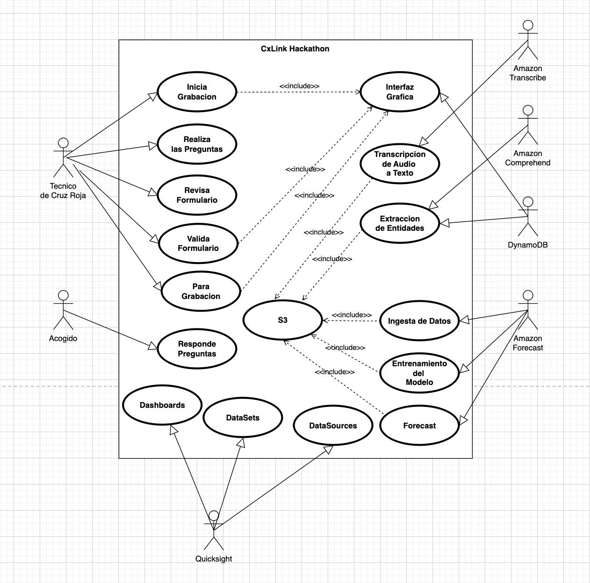
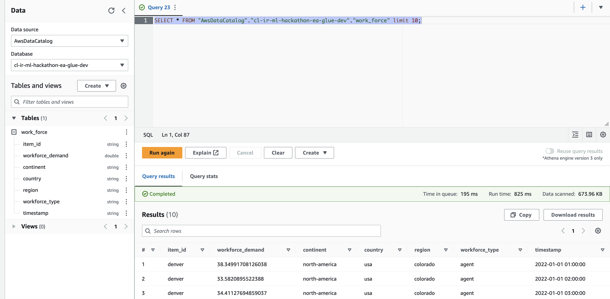

# AWS Hackathon for Good
# CxLink Empathy for Cruz Roja
# La Región de AWS en España al servicio de la sociedad

## Caso de Uso

Esta solución pretende dar respuesta al desafío propuesto por la Cruz Roja en en ambito de la Hackathon for Good organizada por Amazon.

Con ella se pretende, mejorar la calidad de la relación entre el técnico de Cruz Roja que realiza la acogida de una persona con recursos limitados, en situación de exclusión o que necesite ayuda de esta organización por sus circunstancias actuales. La idea es descargar al técnico de tareas que puedan desviar su atención del trato humano con el acogido para que pueda mantener en todo momento el contacto visual con el, realizar una escucha activa y hacer que se sienta lo más cómodo y protegido posible teniendo en cuenta su situación actual.

Se pretende automatizar , en la medida de la posible entonces , la captura de los datos del acogido para rellenar posteriormente el formulario correspondiente como parte del procedimiento de acogida. 

Por otra parte, la solución tiene como objetivo al utilizar estos datos como fuente de datos para realizar tareas relacionadas con su explotación de manera inteligente, mediante analítica de los mismos y/o de su utilización en flujos de ML para realizar predicciones sobre la capacidad necesaria para atender el servicio a fin de optimizar el personal asignado a este servicio.

</br>

## Arquitectura

</br>

### Interfaz Gráfica

La interfaz gráfica es un frontal en JavaScript

### Ingesta y Extracción de Entidades

Durante el proceso de ingesta del audio, transcripción y extracción de entidades, desde la interfaz gráfica el técnico de Cruz Roja iniciará la grabación generandose un archivo de audio en tiempo real que es capturado por el servicio Transcribe.

A continuación, una función Lambda genera un job de transcripción sobre AWS Transcribe. Una vez finalizado el job, se procesa la salida generando un fichero en texto plano con la transcripción, y con esta se genera un job de AWS Comprehend para extraer la información relevante como el DNI, nombre y apellidos, localización etc. Finalmente, las piezas de información obtenidas en este proceso, se almacenan en un JSON en una tabla del servicio DynamoDB para su posterior consumo por parte de la interfaz gráfica.

Vemos un detalle del job de Comprehend:

 </br>

y el modelo de entrenamiento de reconocimiento de entidades personalizado que se ha implementado para la extracción del DNI:

 </br>


### Forecast

La arquitectura de Forecast pretende utilizar los datos del DataSet que provienen de los datos recabados durante cada proceso de acogida para realizar una estimación por inferencia de la fuerza de trabajo de cada tipo necesaria para ofrecer el servicio de acogida (y quizas otro tipo de servicios), permitiendo quizás optimizar y dimensionar adecuadamente los recursos para las ERUs de Cruz Roja en una zona caliente.

La aplicacion recoge los campos extraidos y genera un CSV que se deja en el bucket raw de submissions.

Se implementa entonces un crawler de Glue que analiza el esquema que encuentra en ese CSV en el bucket S3 raw y que crea una tabla Athena en base a ese esquema.

 </br>

Se implementa además un glue job que realiza las transformaciones necesarias (adaptacion del timestamp, nombres de los campos, tipos) para adecuar el dataset al formato de target dataset que espera el servicio de AWS Forecast. Finalmente, la ETL deja el dataset en el formato adecuado en el bucket de datos curados del DataLake.

El script de glue job esta en:

```terraform/enabled/src/glue-jobs/cl-ir-ml-aws-forecast-datasets-transformation
```

</br>

La intefaz gráfica dispone de un boton para lanzar la pipeline de MLOps de entrenamiento del modelo de AWS Forecast (predictor). Este pipeline se ha implementado via CodePipeline con varios stages que recogen las fuentes desde un repositorio CodeCommit donde se alojan los buildspec de los CodeBuils así como los scripts python que realizan la importación de los datos desde el datasource, importando el target dataset sobre el forecast datasetgroup y luego, lanza la creación de un autopredictor, entrenandolo con estos datos de entrada para un domain de Forecast de tipo work_force.

Al finalizar el entrenamiento, el ultimo stage del pipeline de MLOps publica el Forecast. Este Forecast se expone mediante una función lambda que recibe como parámetros el tipo de work_force del que se quiere hacer inferencia así como la fecha de inicio y la fecha de fin.

Esta función Lambda se puede consumir desde la propia interfaz gráfica.

### Analítica

Para la parte de analítica, usamos el DataSet que proviene de los datos recabados durante cada acogida. La aplicacion recoge los campos extraidos y genera un CSV que se deja en el bucket raw de submissions.

La ETL que ha generado la tabla Athena correspondiente permite crear un DataSet de tipo Athena que se puede usar en  Quicksight (que es el servicio de AWS de BI que nos permitirá generar los dashbords y análisis necesarios) para realizar la analítica de los datos recogidos.




## Toolset Utilizado

- Jira

Se ha utilizado para gestionar el proyecto de acuerdo a un modelo agile Kanban.

- Draw IO - (https://draw.io)

Se ha utilizado para crear los diagramas de arquitectura.

- Canva (https://www.canva.com)

Se ha utilizado para el diseño del story board para la elaboración del video.

- iMovie

Se ha utilizado para el montaje del video.

- Terraform (https://www.terraform.io/)

Se ha utilizado para la generación de la Infraestructura como Código (Iac) a fin de seguir las buenas prácticas de DevOps.

- JavaScript

Se ha utilizado para el desarrollo del frontend de la aplicación con la que interactúa el agente de acogida.

- Go

Se ha utilizado en la codificación de las funciones lambdas utilizadas para la extracción, filtrado y consolidación de las entidades obtenidas a partir de las transcripciones generadas por Amazon Transcribe a partir de la conversación grabada en tiempo real.

- Python

Se ha utilizado para la codificación de las lambdas y scripts de build de CodeBuild relacionadas con el pipeline de importacion, entrenamiento y obtención del forecast de Amazon Forecast.

- Bash 

Se ha utilizado en ciertos scripts de apoyo para tareas básicas de infraesctructura.

## Repositorios de Código

- GitLab (https://gitlab.com/syntax-cloud/sap-products/cxlink-devops/cxlinkevents.git)

Se utiliza un repositorio de código para almacenar todo el código terraform relacionado con la infraestructura así como el código del frontend de la aplicación y el código de las funciones lambda utilizadas.

Para clonar el repositorio y poder utilizarlo, proponemos configurar un par de claves SSH en el sistema CSV gitlab. Debemos entonces, crear un archivo con la clave SSH privada en una ruta conocida, por ejemplo /Users/<usuario>/.ssh/id_rsa_gitlab en un sistema Mac OS.

Debemos luego configurar el acceso SSH en el archivo /Users/<usuario>/.ssh/config con el siguiente contenido:

```
Host gitlab.com
  IdentityFile 	/Users/danisoto/.ssh/id_rsa_gitlab
```

Para clonar el repo y crear una rama a partir de la rama master:

```
git clone git@gitlab.com:syntax-cloud/sap-products/cxlink-devops/cxlinkevents.git
cd cxlinkevents

git remote add origin git@gitlab.com:syntax-cloud/sap-products/cxlink-devops/cxlinkevents.git
git checkout master
git branch -M feature/my_amaizing_feature
git push -uf origin master

```

- CodeCommit (https://git-codecommit.eu-west-1.amazonaws.com/v1/repos/cl-ir-ml-hackathon-mlops-dev)

Se utiliza un repositorio de código codecommit como fuente para los buildspecs y el código Python necesario para la implementación de CodePipeline de importación, entrenamiento del predictor de AWS Forecast y la generación del Forecast correspondiente.

Los pasos para acceder al código de este repositorio, son:

### Instalación de la AWS CLI

Deberemos instalar el aws cli para nuestro sistema operativo. Para ello, disponemos del siguiente procedimiento:

https://docs.aws.amazon.com/cli/latest/userguide/getting-started-install.html


A continuacion, debemos configurar el cliente git para poder acceder al repo. Para ello, en el .gitconfig, podemos añadir esta entrada:

```
[credential "https://git-codecommit.eu-west-1.amazonaws.com/v1/repos/cl-ir-ml-hackathon-mlops-dev"]
    helper =
    helper = !aws --profile terraform-ht-ir-dev codecommit credential-helper $@
    UseHttpPath = true
```

donde terraform-ht-ir-dev, será un profile de la aws cli con las credenciales necesarias. 
Por ejemplo:

```
[profile terraform-ht-ir-dev]
region=eu-west-1
output=json
aws_access_key_id=<ACCESS_KEY_ID>
aws_secret_access_key=<SECRET_ACCESS_KEY>

```

Una vez tengamos configurado el cliente git, podemos clonar el repo con:

```
git clone https://git-codecommit.eu-west-1.amazonaws.com/v1/repos/cl-ir-ml-hackathon-mlops-dev
cd cl-ir-ml-hackathon-mlops-dev

git remote add origin https://git-codecommit.eu-west-1.amazonaws.com/v1/repos/cl-ir-ml-hackathon-mlops-dev
git checkout master
git branch -M feature/my_amaizing_feature
git push -uf origin master

```

## CI/CD

El deployment de la infraestructura y del código de las funciones lambda, actualmente, se realiza sin niguna herramienta de CI/CD específica. Los deploys se hacen localmente pero sería trivial crear una pipeline con los pasos para el deploy vía terraform utilizando CodePipeline, Circle CI, TeamCity, Jenkins, gitlab, etc...

Si se han utilizado dos sistemas CSV para mantener el código (CodeCommit y GitLab), y se han seguido las buenas prácticas de generar código multientorno para desplegar previamente en un entorno de preproducción (e incluso QA o TEST) antes de hacerlo en producción.

Para orquestar el workflow de ingesta de datos de Amazon Forecast, el entrenamiento del modelo de ML (Predictor) mediante AutoML y la publicación del forecast que permite obtener el workforce_demand para un tipo de workforce específico, hemos recurrido a una pipeline implementada con CodePipeline que es completamente funcional y que es lanzada desde una función lambda que permite lanzarlo directamente desde la interfaz gráfica.


## Deploy de la Infraestructura

El código de IaC se basa en terraform. Las funciones lambda que utilizamos se despliegan como contenedores docker sobre un repositorio ECR. El código está completamente preparado para funcionar en multientorno (dev, test, pre y prod) y multiaccount y/o multiregion.

Los pasos para el deploy son, desde la raíz del repositorio de infraestructura (git@gitlab.com:syntax-cloud/sap-products/cxlink-devops/cxlinkevents.git) una vez hemos hecho el pull de los ultimos cambios a nuestro local.

Utilizaremos workspaces de terraform, uno por cada entorno. Debemos crear el workspace solamente la primera vez.


``` 
git pull
cd terraform/enabled/
terraform init
terraform workspace create dev
terraform workspace select dev
terraform apply -var-file=../config/dev.vars
``` 

En este momento, terraform nos mostrará los cambios que va a realizar en la infraestructura. Si nos parecen correctos, teclearemos yes y entonces terraform procederá a desplegar los cambios sobre la infra.

El código de las funciones lambda está disponible en la ruta terraform/enabled/src/lambdas donde existe un directorio para cada funcion lambda con un Dockerfile que determina como se construirá el contenedor de la función lambda.

Los scripts hash.sh y push.sh se ocupan de determinar si ha habido cambios en las funciones lambda, el Dockerfile, etc... y si ha habido cambios, se hace el build del nuevo docker y se publica en el repositorio ECR. Finalmente, se actualiza la función lambda para que apunte a este nuevo contenedor.

El layout de la infraestructura es modular y se compone actualmente de los siguientes módulos:

```

├── app
│   ├── amplify
│   ├── auth
│   ├── back
│   ├── front
│   └── storage
├── bi
│   └── quicksight
├── database
│   └── dynamodb
├── landing_zone
│   └── 585543526779
└── ml
    ├── aws-forecast
    ├── comprehend
    ├── etl
    ├── lambda
    └── mlops

    

```


- landing_zone

Donde va el código de la infraestructura compartida por todos los demás módulos como pueden ser las claves KMS custom creadas para cada servicio (s3, comprehend, lambda, ...) a fin de encriptar en reposo todos los recursos que admiten encriptación como buenas práctica de seguridad.

- database

Este módulo se destina al código terraform de las bases de datos. En nuestro caso, se utiliza para la base de datos NoSQL DynamoDB que almacena los registros de cada acogida realizada.

- bi

En este módulo se despliega la infra necesaria para la analítica, fundamentalmente relacionada con el servicio Quicksight.

- app

En este módulo se despliega el código relacionado con el frontend del aplicativo desarrollado en JavaScript puro.

- ml

En este módulo, tenemos todo lo relacionado con los workflows de ML, desde los relacionados con el MLOps que implementa el ciclo de ingesta de los datos, entrenamiento del modelo de Amazon Forecast y despliegue del modelo como Forecast accesible mediante una función lambda que consulta ese valor de forecast para un tipo de workforce determinado, pasando por el código relacionado con el servicio comprehend que se encarga de detectar las entidades en los chunks de audio, las funciones lambda que realizan estas operaciones de extraccion de entidades, filtrado y consolidacion.

También se deja el código de una ETL que podría servir para realizar algun tipo de transformación en los datos obtenidos desde la lambda de consolidacion a fin de presentar los datos en el formato adecuado necesario para el servicio Amazon Forecast.

## Deploy del Frontend

```
Hemos utilizado el siguiente repositorio público como ejemplo:
Ref: https://github.com/awsdocs/aws-doc-sdk-examples/tree/main/javascriptv3/example_code/cross-services/transcribe-streaming-app
````

Frontend se deploya con el resto de la infrastructura sobre un servicio Fargate detras de un load balancer público. Frontend corre sobre NGINX en una imagen basada en amazonlinux con arm64. En el directorio [terraform/enabled/src/front](terraform/enabled/src/front) se encuentra el Dockerfile y el código utilizado para el build de la imagen.

## Consideraciones de Seguridad

Todos los servicios donde es posible realizar encriptación en reposo, esta se ha realizado utilizando claves KMS personalizadas para cada servicio (buckets S3, logs de CloudWatch, imagenes dockerizadas, ...).

## Costes

Como herramienta para la gestión de costes infraestructura, hemos utilizado CloudHealth que arroja el siguiente valor de coste de despligue de esta solución:


## Agile

Para la gestión del proyecto, hemos utilizado metodología Kanban utilizando Jira como herramienta de gestión:


## Autores y Agradecimientos

- Guillermo Torres
- Pere Pasamonte
- Daniel Soto

Como parte del equipo del CxLink DevOps Team.

Agradecimiento especial a :

- Marina Brandana (CxLink Operations Administrator)

Por su apoyo en la elaboración del video y el aporte de ideas en el área de marketing.

- Gerard Lagalina (Product Team Lead)

Por su inspiración durante el proyecto. 

- Ricardo Casanovas (VP of SAP Product & Innovation at Syntax CxLink)

Por conseguir que la empresa nos de los recursos de tiempo e infraestructura para poder acometer esta solución.

- Pablo Muñoz Riquel (Amazon Connector Specialist)

Por su apoyo en la implementación aportando ideas que , aunque no estaban en el scope de la solución, nos permitió descartar algunos servicios que, aunque son fabulosos, no nos daban la solución más adecuada para lo que queriamos hacer.

